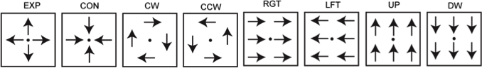

```{r configuration, echo=FALSE, error=FALSE, include=FALSE, warning=FALSE, message=FALSE}
# Source libraries

library(ggplot2)
library(dplyr)
library(nlme)
library(knitr)
library(tidyr)
opts_chunk$set(comment=NA, fig.width=8, fig.height=4.5, echo=FALSE, error=FALSE, warning=FALSE, message=FALSE, include=FALSE)

# Directories
dir.data <- '../data'
dir.figs <- '../figs'

# File names
fn_sim_spd_hist <- 'simulation-speed-hist.csv'
fn_seg_duration <- 'coded-segments.csv'
fn_spd_hist_bins <- 'speed-histogram-bins.csv'
fn_spd_hist_fits <- 'speed-histogram-fits.csv'
```

## What Accounts for Developmental Shifts in Optic Flow Sensitivity?

<div class="centered">

### Rick O. Gilmore, Penn State

### Florian Raudies, HP Labs

### Swapnaa Jayaraman, Indiana University

<https://databrary.org/volume/81>

<https://github.com/gilmore-lab/ICDL-EpiRob-2015>

*Support*: NSF BCS-1147440, NSF BCS-1238599, NICHD U01-HD-076595
</div>

## Background

- What is Optic Flow?
- How Does Optic Flow Sensitivity Develop?

## What is Optic Flow?

- Structured pattern of visual motion generated by observer movement
- Radial, rotational, translational/laminar patterns


<div class="centered">
  
</div>

## How Does Optic Flow Sensitivity Develop?

- Sensitivity at birth
- Infants more sensitive to fast, translational flow
- Adults more sensitive to slow, radial flow

## Natural Scene Statistics of Optic Flow

- [*Raudies & Gilmore ICDL-EpiRob 2012*](http://ieeexplore.ieee.org/xpl/login.jsp?tp=&arnumber=6400584&url=http%3A%2F%2Fieeexplore.ieee.org%2Fxpls%2Fabs_all.jsp%3Farnumber%3D6400584)
    - Infants experience faster flow than mothers even when geometry, speed of locomotion equated.
- [*Raudies & Gilmore, Neural Computation, 2014*](http://www.mitpressjournals.org/doi/abs/10.1162/NECO_a_00645#.Va6g-hNViko)
    - Motion "prior" for infants faster than for mothers
    - Empirical motion priors not "slow" as predicted by theory

## This Study Asks

- What are the statistics of infants' optic flow experiences in more natural contexts?
- Do the statistics help explain development in sensitivity?
- Do cultural differences (home geometries, carrying practices, etc.) carry much weight?
- Are fast, translational flows common?

## Approach

- Simulating changes in optic flow due to changes in body size & posture, geometry
- Empirical measurement of flow experienced in natural contexts

## Theoretical Framework

- What changes in *development* or *culture* might influence optic flow?
- Posture: Walking vs. Crawling
    - Distance to ground surface
    - Head pitch relative to ground
- Geometry: Typical distance to surfaces, objects

<div class="centered">
$\begin{pmatrix}\dot{x} \\ \dot{y}\end{pmatrix}=\frac{1}{z}
\begin{pmatrix}-f & 0 & x\\ 0 & -f  & y \end{pmatrix}
\begin{pmatrix}{v_x{}}\\ {v_y{}} \\{v_z{}}\end{pmatrix}+
\frac{1}{f}
\begin{pmatrix}
xy & -(f^2+x^2) & fy\\ 
f^2+y^2 & -xy & -fy
\end{pmatrix}
\begin{pmatrix}
\omega_{x}\\ 
\omega_{y}\\ 
\omega_{z}
\end{pmatrix}$
</div>

## Parameters For Simulation

Kretch, Franchak, & Adolph (2014), <http://dx.doi.org/10.1111/cdev.12206>

| Parameter | Crawling Infant | Walking Infant |
|-----------|-----------------|----------------|
| Eye height| 0.30 m          | 0.60 m         |
| Locomotor speed | 0.33 m/s  | 0.61 m/s       |
| Head tilt | 20 deg          | 9 deg          |

## Parameters for Simulation

| Geometric Feature        | Distance |
|--------------------------|----------|
| Side wall                | +/- 2 m  |
| Side wall height         | 2.5 m    |
| Distance of ground plane | 32 m     |
| Field of view width      | 60 deg   |
| Field of view height     | 45 deg   |

## Simulating Flow Fields {.flexbox .vcenter}

<div class="centered">
  
</div>

## Flow Direction Distributions by Geometry & Posture

<div class="centered">
  
</div>

## Flow Speeds By Geometry and Posture {.flexbox .vcenter}

```{r crawl-vs-walk-simulated-speeds}
# Load speed histogram data from simulation
df.in <- read.csv( paste(dir.data, fn_sim_spd_hist, sep="/"), header=FALSE )

geom.names <- unlist( df.in[,1] )
locomotion.names <- unlist( df.in[,2] )
vals <- t( df.in[,3:23] )

bins <- seq(0,45, length.out=21)

df.th <- data.frame( Bin.Ctr = bins,
                     Geometry = rep( geom.names, each=21 ),
                     Locomotion = rep( locomotion.names, each=21 ),
                     Bin.Ct = as.vector( unlist( vals ) ) 
)

# Summarize counts by locomotion status
df.th.crawl <- df.th %>%
  filter( Locomotion == "crawling" ) %>%
  group_by( Geometry, Bin.Ctr ) %>%
  summarize( crawling.ct = sum( Bin.Ct) )

df.th.walk <- df.th %>%
  filter( Locomotion == "walking") %>%
  group_by( Geometry, Bin.Ctr ) %>%
  summarize( walking.ct = sum( Bin.Ct ))

# Merge data frames for analysis
df.th.loco <- merge( df.th.crawl, df.th.walk, 
                     by.x=c("Geometry", "Bin.Ctr"), 
                     by.y=c("Geometry", "Bin.Ctr")
) %>% mutate( tot.ct = crawling.ct + walking.ct ) %>%
  group_by( Geometry ) %>%
  mutate( tot.geom.ct = sum( tot.ct ) ) 

p.thresh = .05
df.th.loco.stats <- df.th.loco %>%
  filter(tot.ct >= 5) %>%
  mutate( num = (walking.ct/tot.geom.ct - crawling.ct/tot.geom.ct)^2,
          denom = walking.ct/(tot.geom.ct^2) + crawling.ct/(tot.geom.ct)^2,
          chisq = num/denom ) %>%
  group_by(Geometry) %>%
  summarize( chisq.loco = sum( chisq ) ) %>%
  mutate( p.chisq = 1-pchisq( chisq.loco, 21) ) %>%
  filter( p.chisq < p.thresh )
```

<div class="centered">
```{r simulation-histogram-plot, include=TRUE}
# Plot
p <- ggplot( data=df.th, aes(x=Bin.Ctr, y=Bin.Ct, fill=Locomotion)) +
  geom_bar(position="dodge", stat="identity") +
  facet_grid(. ~ Geometry)+
  xlab("Speed (deg/s)") +
  ylab("Number of observations") +
  theme( strip.text=element_text(size=20), 
         axis.title=element_text(size=20),
         axis.text =element_text(size=18),
         legend.title=element_text(size=20),
         legend.text = element_text(size=20), 
         legend.position="bottom"
         )
p
```

```{r simulation-stats}
```

$\chi^2(20)$: `r df.th.loco.stats[1,1]`: `r df.th.loco.stats[1,2]`, `r df.th.loco.stats[2,1]`: `r df.th.loco.stats[2,2]`, `r df.th.loco.stats[3,1]`: `r df.th.loco.stats[3,2]`, and `r df.th.loco.stats[4,1]`: `r df.th.loco.stats[4,2]`.
</div>

## Mean Simulated Flow Speeds By Posture and Geometry

| Type of Locomotion | Ground Plane | Room | Side Wall | Two Walls |
|--------------------|--------------|------|-----------|-----------|
| Crawling           | 14.41        | 14.42| 14.43     |14.62      |
| Walking            | 9.38         | 8.56 | 7.39      |9.18       |

## Empirical Measurements of Optic Flow

- First-person videos from head-mounted cameras
- 20 infants, 41 days to 13.2 mos
- Chennai, India & Bloomington, Indiana
- Data: <http://databrary.org/volume/81>

## Cultural Differences in Segment Durations {.flexbox .vcenter}

```{r segment-durations}
# read data file
df.segments <- read.csv(paste(dir.data, fn_seg_duration, sep="/"))

# Restrict consideration to segments < 3 min
df.segments.3m <- df.segments %>% 
  mutate(Minutes=Segment.ms/(1000*60)) %>%
  filter(Motion.Static != 'Unclassified') %>%
  filter(Minutes <= 3)

# Adjust country order
countries <- relevel(df.segments.3m$Country, "U.S.")
df.segments.3m$Country <- countries

# Calculate summary stats to annotate plot
df.summary <- df.segments.3m %>%
  group_by(Country, Motion.Static) %>%
  summarize(Minutes.med = median(Minutes),
            Minutes.mean = mean(Minutes))

df.summary$Minutes = c(1,1,1,1)

# Convert minutes to seconds for readability
df.summary$Label.med = paste0("median = ", round(df.summary$Minutes.med*60, 1), " s")
df.summary$Label.mean = paste0("mean = ", round(df.summary$Minutes.mean*60, 1), " s")
```

<div class="centered">
```{r segment-duration-plot, include=TRUE}
# Plot
p <- ggplot(df.segments.3m, aes(x=Minutes)) +
  facet_grid(Motion.Static ~ Country) + 
  geom_histogram() +
  ylab('Number of Segments') +
  xlab('Segment Duration (min)') +
  theme_bw() +
  geom_text(data=df.summary, aes(x=rep(1.5,4), y=rep(400,4), label=Label.med), size=7) +
  geom_text(data=df.summary, aes(x=rep(1.5,4), y=rep(300,4), label=Label.mean), size=7) +
  theme(panel.grid.major = element_blank(), panel.grid.minor = element_blank()) +
  theme(strip.text = element_text(size=20), 
        axis.title = element_text(size=20),
        axis.text = element_text(size=20))
p
```
</div>

<!--
## Individual Differences in Segment Durations {.flexbox .vcenter}

```{r segment-durations-individual-diffs, include=TRUE}
p <- ggplot(data=df.segments.3m, aes(x=Minutes, color=Participant.ID)) +
  facet_grid(Motion.Static ~ Country) +
  geom_density() +
  ylab('Density') +
  xlab('Segment Duration (min)') +
  guides(color=FALSE) +
  theme(panel.grid.major = element_blank(), 
        panel.grid.minor = element_blank(),
        strip.text = element_text(size=20), 
        axis.title = element_text(size=20),
        axis.text = element_text(size=20)
  )
p
```
-->

## Summary of Segment Duration Effects {.flexbox .vcenter}

<div class="centered">
```{r anova-segment-duration-plot}
# Restrict analysis to Moving and Stationary conditions
keep <- c("Moving", "Stationary")
df.motion.static <- subset(df.segments, Motion.Static %in% keep)
df.motion.static$Motion.Static <- factor(df.motion.static$Motion.Static)

# Restrict to segments < 1.5 min to reduce effects of outliers
df.trim.1.5min <- df.motion.static %>%
  filter(Segment.ms <= 1.5*60*1000)

# Create summary data frame
df.trim.1.5min.summ <- df.trim.1.5min %>%
  group_by(AgeMatchGroup, Country, Participant.ID, Motion.Static) %>%
  summarize(Segment.ms.med = median(Segment.ms),
             Segment.ms.sem  = sd(Segment.ms)/sqrt(n()),
             Segment.ms.mean = mean(Segment.ms)) %>%
  mutate(Segment.sec.mean=Segment.ms.mean/1000, Segment.sec.sem=Segment.ms.sem/1000)

c <- relevel( df.trim.1.5min.summ$Country, "U.S.") # make U.S. first for consistency
df.trim.1.5min.summ$Country <- c
```

```{r, include=TRUE}
# Plot
ylims <- aes(ymax=Segment.sec.mean+Segment.sec.sem, ymin=Segment.sec.mean-Segment.sec.sem)
p <- ggplot( data=df.trim.1.5min.summ, aes(x=AgeMatchGroup, y=Segment.sec.mean, color=Motion.Static)) +
  facet_grid(. ~ Country) +
  geom_point() +
  geom_pointrange(ylims) +
  geom_smooth( method=lm ) +
  scale_color_discrete( name="Motion Status") +
  xlab("Age Group (wks)") +
  ylab("Segment Duration (s)") +
  theme(strip.text=element_text(size=20), 
        axis.title=element_text(size=20),
        axis.text=element_text(size=16),
        legend.text=element_text(size=18),
        legend.title = element_text(size=18),
        legend.position ="bottom")
p
```
</div>

## Normalized Durations as p(total-time) {.flexbox .vcenter}

<div class="centered">
```{r}
# Start with untrimmed.
# Fix leveling order...again
c <- relevel( df.motion.static$Country, "U.S.") # make U.S. first for consistency
df.motion.static$Country <- c

# Sum total duration by participant and motion condition
df.motion.static.summ.by.motion <- df.motion.static %>%
  group_by(Country, AgeMatchGroup, Participant.ID, Motion.Static) %>%
  summarize(Segment.ms.tot = sum(Segment.ms))

df.motion.static.summ.grand <- df.motion.static.summ.by.motion %>%
  group_by(Country, AgeMatchGroup, Participant.ID) %>%
  summarize(Segment.ms.tot.grand = sum(Segment.ms.tot))

df.motion.static.summ <- merge( df.motion.static.summ.grand, df.motion.static.summ.by.motion)

df.motion.static.summ <- df.motion.static.summ %>%
  group_by( Country, AgeMatchGroup, Participant.ID, Motion.Static) %>%
  summarize(Segment.ms.p = Segment.ms.tot/Segment.ms.tot.grand)
```

<div class="centered">
```{r, include=TRUE, fig.width=8, fig.height=4}
# Now plot
p <- ggplot(data=df.motion.static.summ, aes(x=AgeMatchGroup, y=Segment.ms.p, color= Motion.Static)) +
  facet_grid( . ~ Country ) +
  geom_point() + 
  geom_smooth( method=lm ) +
  xlab("Age Group (wks)") +
  ylab("Proportion of Time") +
  theme(strip.text = element_text(size=20), 
        axis.title = element_text(size=20),
        axis.text = element_text(size=20),
        legend.text = element_text(size=18),
        legend.title = element_text(size=18)) +
  theme(legend.position="bottom") + 
  scale_color_discrete(name="Motion Status")
p
```

```{r normalized-speed-stats}
lme.p.segment <- lme(fixed = Segment.ms.p ~ Country*AgeMatchGroup, data = df.motion.static.summ[df.motion.static.summ$Motion.Static=='Stationary',], random = ~ 1 | Participant.ID)
ul = unlist(anova(lme.p.segment))
```
Age: $F(`r ul['numDF3']`,`r ul['denDF3']`)=`r ul['F-value3']`, p=`r ul['p-value3']`$

Age x Country: $F(`r ul['numDF4']`,`r ul['denDF4']`)=`r ul['F-value4']`, p=`r ul['p-value4']`$

</div>

## Natural Scene Statistics for Optic Flow

- Selected 5 x 5 s segments/participant, both moving and stationary
- Estimated frame by frame flow fields
- Details in [Raudies & Gilmore 2014](http://www.mitpressjournals.org/doi/abs/10.1162/NECO_a_00645#.Va6g-hNViko)

## Speed Distributions {.flexbox .vcenter}

<div class="centered">
```{r speed-distributions, include=TRUE}
# Load data
df_speed_hist <- read.csv(paste(dir.data, fn_spd_hist_bins, sep="/"))

df_speed_hist$Country <- relevel( df_speed_hist$Country, "U.S.")

# U.S Histogram
p <- df_speed_hist %>% 
  ggplot(aes(x=Speed, y=N_obs)) +
  facet_grid(Motion_status ~ Country) +
  geom_bar(stat="identity") +
  ylab('N observations') +
  xlab('Speed (deg/s)') +
  theme(panel.grid.major = element_blank(), 
        panel.grid.minor = element_blank(),
        strip.text = element_text(size=20), 
        axis.title = element_text(size=20),
        axis.text = element_text(size=20)
  )
p
```
</div>

## Comparing Shapes of (Trimmed) Speed Distributions

- Fit $\gamma$ distribution to trimmed (0,100) speed histograms

<div class="centered">
$f(x;k,\theta) =  \alpha\frac{x^{k-1}e^{-\frac{x}{\theta}}}{\theta^k\Gamma(k)}$

$\alpha$, amplitude; $\kappa$, shape; and $\theta$, scale parameters.
</div>

## Moving ≠ Stationary {.flexbox .vcenter}

<div class="centered">

</div>

## Moving ~ Stationary{.flexbox .vcenter}

<div class="centered">

</div>

## {.flexbox .vcenter}

<div class="centered">

</div>

## Analysis of Fitted $\kappa$ Parameters {.flexbox .vcenter}

<div class="centered">
```{r speed-fitted-parameters}
# Load data
df.merged <- read.csv(paste(dir.data, fn_spd_hist_fits, sep="/"))

# Re-label to fix country order
countries <- relevel(df.merged$Country, "U.S.")
df.merged$Country <- countries

# Fix Motion.Static level labels
levels(df.merged$Motion.Static) <- c("Moving", "Stationary")
```

```{r kappa-plot, include=TRUE}
# Plot $\kappa$ parameter
p.k <- df.merged %>%
  gather(Parameter.name, Fitted.value, alpha, kappa, theta ) %>%
  filter(Parameter.name=='kappa') %>%
  ggplot(aes(x=Motion.Static, y=Fitted.value, color=Motion.Static)) +
  facet_grid(. ~ Country) +
  geom_boxplot() +
  geom_point() +
  xlab("") + 
  ylab("Parameter Estimate") +
  theme(strip.text = element_text(size=20), 
        axis.title = element_text(size=20),
        axis.text = element_text(size=20),
        legend.position="none")
p.k
```

```{r kappa-stats}
lme.k.country <- lme(fixed = kappa ~ Motion.Static*Age_group_match + Country, random = ~ 1 | Participant.ID, data=df.merged)
ul <- unlist(anova(lme.k.country))
```
Country: $F(`r ul['numDF4']`,`r ul['denDF4']`)=`r ul['F-value4']`, p=`r ul['p-value4']`$
</div>

## Change in $\kappa$ Across Age {.flexbox .vcenter}

<div class="centered">
```{r kappa-by-age, include=TRUE}
p.k <- df.merged %>%
  gather(Parameter.name, Fitted.value, alpha, kappa, theta ) %>%
  filter(Parameter.name=='kappa') %>%
  ggplot(aes(x=Age_group_match, y=Fitted.value, color=Motion.Static)) +
  facet_grid(. ~ Country) +
  geom_point() +
  geom_smooth(method=lm) +
#  ggtitle(expression(paste("Distribution of ", kappa, " parameter"))) +
  xlab("Age Group (mos)") +
  ylab("Parameter Estimate") +
  theme(strip.text = element_text(size=20), 
        axis.title = element_text(size=20),
        axis.text = element_text(size=20),
        legend.position="none")
p.k
```

Country x Age: $F(`r ul['numDF5']`,`r ul['denDF5']`)=`r ul['F-value5']`, p=`r ul['p-value5']`$
</div>
## Empirical Pattern Distributions

- Correlation with 'canonical' flow patterns
  - radial
  - rotational
  - translational
  
## Pattern Correlation Results

<div class="centered">

</div>

## Conclusions: Simulation

- Posture influences optic flow speeds & patterns
    - Crawling: faster speeds, more translational flow
    - Proximity to ground and pitch of head matter
    - Geometry matters relatively little
    
## Conclusions: Empirical Data

- Time stationary >> time in motion
- Time stationary declines with age (India)
- Fast speeds, broad speed distributions
- Individual differences in moving vs. stationary speed distributions
- Translational flow >> radial or rotational flow

## Questions to Ponder

- How might optic flow experiences shape perception?
    - Differences between self vs. other-produced motion?
    _ Influence of independently moving objects/people?
- How do optic flow experiences shape brain responses?

## Stack

- Databrary, <https://nyu.databrary.org/volume/81>
    - Access to identifiable data (e.g. videos) restricted
    - Access agreement + institutional authorization
- Datayvu, <http://datavyu.org>
- Matlab
- RStudio, <https://www.rstudio.com/>
    - R Markdown, <http://rmarkdown.rstudio.com/>
- GitHub, <http://github.com/gilmore-lab/ICDL-EpiRob-2015>